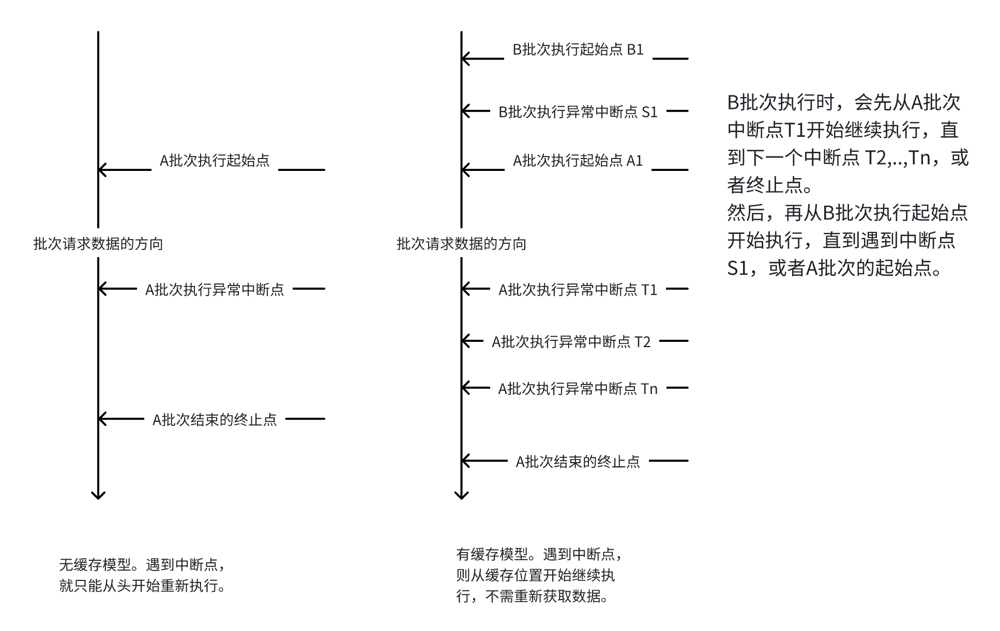

# 微博等信息流数据处理、聚合工具

### 功能
对微博 weibo、长毛象 mastodon 的 follow 数据进行抓取，并进行信息的过滤、整合、分组。

过滤的特征：
- 有效长度比较短的，启用屏蔽词过滤策略。
- 有效长度足够的，判定为有价值内容，予以放行。
- 只提取和存储目标用户id的微博数据。

整合：
- 能够对同一天内的同一条微博的多次转发，合并成一条微博。而不是存储为多条微博。
- 对转发链上的冗余信息过滤。

分组：
- 自主设置user_id和分组名，将不同用户的数据进行分组。

数据缓存机制：
- 能够在一个批次的调用失败后，将本次获取到的数据暂存。当下一次重新执行时，从暂存点开始继续执行。
- 会补上从当前时间到上一个执行批次这段时间内的数据。
- 提升性能。


### 自动执行
通过 crontab 中配置定时任务，让程序定期执行。
```commandline
crontab -e
```

### 各程序入口
主程序入口
- main.py 主程序

tools
- data_cleaner.py 数据清理程序，可单独运行。对数据进行清洗、去重、重排。
- auto_notify.py 网络监控、通知程序，当无法正常访问 api 时，会发送微信消息通知。三方通知接口需要自行申请，配置在 config.ini 中。
- ping_test.py 用于网络检测的程序。快速检测接口是否能 ping 通
- fbw_manager.py 对 forbidden_words.txt 的文件的操作程序，可以在终端中以命令行的方式操作 forbidden_words.txt 文件数据
- config_manager.py 操作config.ini
- finish_target_day_cache.py 用于每日job，检查前一天cache是否全部处理完毕，若没有则自动处理前一天cache。此工具也可用于手动完成特定日期的缓存数据落地。

各程序的执行参数，可以通过 -h 查看。

### 资源文件
- config.ini 项目配置文件
- focus_user.ini weibo的关注列表，并且对进行的输出的分组，在对应分组内添加用户的 id
- forbidden_words.txt 屏蔽词列表。当 weibo 数据中出现屏蔽词时，予以屏蔽。

### 其他
- ~~export 数据输出目录。数据会 export/weibo/group/2023-07-01/... 这个目录下生成 .html 文件。~~
- 数据输出目录外置。在 config.ini 文件中配置，不再放在项目目录中。数据会在 {export}/weibo/group/2023-07-01/... 这个形式的目录下生成 .html 文件。
- logs 日志文件
- test 测试

### 初次使用注意
需要在 config.ini 中，手动填写好相关配置。其中，created_at 是必须要填的，需要从接口中复制出原始数据，保持相同的数据格式。last_id 则无所谓，可以任意填写。其他参数，按需要填写。
成功运行一次后，每次执行之后，last_id, created_at 值都会自动更新。

使用方法
```commandline
python3 main.py
```

### 其他注意
由于main主程序对数据的处理不够精细，存在数据重复的情况。所以，推荐在 main.py 执行过后，紧接着执行 data_cleaner.py,清理数据。
例如，我在 crontab 中的配置如下
```commandline
0 * * * * /opt/homebrew/bin/python3 /Users/evalcony/coding/py-proj/weibo-proj/main.py >> /Users/evalcony/coding/py-proj/weibo-proj/logs/file.log 2>&1; /opt/homebrew/bin/python3 /Users/evalcony/coding/py-proj/weibo-proj/tools/data_cleaner.py >> /Users/evalcony/coding/py-proj/weibo-proj/logs/file-t.log 2>&1
```
在 main.py 执行过后，紧接着执行 data_cleaner.py。main.py 的日志输出到 logs/file.log 中；data_cleaner.py 的日志输出到 logs/file-t.log 中。

### 生成项目目录结构

```
tree -I 'export|__pycache__|test|test_export|logs|cache' > proj-structure.txt
```

### 一些待优化的问题
- 一些数字的关键字，会在url地址中检测到，导致屏蔽。例如666。
- 关于内容的智能识别。判断哪些是高价值内容，哪些是低价值内容。
- 在系统级别的后台执行中，无法停止，只能通过杀进程的方式来停。需要有项目级别的随时停止的能力。（也许可以通过每次读取config.ini实现。）杀进程会导致 crontab 可能无法自动启动。
- 当原作者和转发处于同一个group分组时，对同一条微博的展示，应该只出现一次。